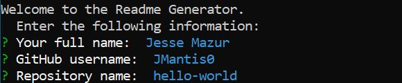

## Readme-Generator
    

## Description

This project is a command-line node application that aids developers in the generation of a quality readme for repositories on GitHub.

## Table of Contents

* [Installation](#installation)
* [Credits](#credits)
* [License](#license)

## Installation and Usage

1) Install node.  Use the [package manager][] of your choice.
2) Clone this repository
3) Execute command `cd readme-generator`
4) Execute command `npm i`
5) Execute command `node index.js`
6) Follow in-app prompts

[package manager]: https://nodejs.org/en/download/package-manager/

## Credits

Trilogy, University of Washington

## License

Copyright (c) 2020 Jesse Mazur

Permission is hereby granted, free of charge, to any person obtaining a copy
of this software and associated documentation files (the "Software"), to deal
in the Software without restriction, including without limitation the rights
to use, copy, modify, merge, publish, distribute, sublicense, and/or sell
copies of the Software, and to permit persons to whom the Software is
furnished to do so, subject to the following conditions:

The above copyright notice and this permission notice shall be included in all
copies or substantial portions of the Software.

THE SOFTWARE IS PROVIDED "AS IS", WITHOUT WARRANTY OF ANY KIND, EXPRESS OR
IMPLIED, INCLUDING BUT NOT LIMITED TO THE WARRANTIES OF MERCHANTABILITY,
FITNESS FOR A PARTICULAR PURPOSE AND NONINFRINGEMENT. IN NO EVENT SHALL THE
AUTHORS OR COPYRIGHT HOLDERS BE LIABLE FOR ANY CLAIM, DAMAGES OR OTHER
LIABILITY, WHETHER IN AN ACTION OF CONTRACT, TORT OR OTHERWISE, ARISING FROM,
OUT OF OR IN CONNECTION WITH THE SOFTWARE OR THE USE OR OTHER DEALINGS IN THE
SOFTWARE.
